# Files Finder

> Xavier Schwab et Sacha Grenier
> Avec la participation de Nicolas Henry
> Si-T1A – CPNV ES
> Chefs de projet et clients : Chevillat Jerome & Hurni Pascal

## Table des matières
[TOC]
## Spécifications
### Titre
Application de recherche avancée de documents sur un répertoire précis
### Description
Ce projet nous a été demandé par un client. L’idée est de créer une application pour retrouver des fichiers qui avec le temps sont devenus trop nombreux. 

> Une réalisation générique de ce projet permettra d'utiliser la plateforme sur n’importe quel ordinateur équipé d’un système d’exploitation Windows.

### Matériel et logiciels à disposition

* Ordinateur standard CPNV
* Visual Studio 2017
* Suite Adobe
* Suite Office 2017
* Application de gestion de projet (Trello)
* Un dépôt GIT
* C# .NET 4.6.1
* Balsamiq Mockups 3
### Prérequis
Un niveau en C# CFC est nécessaire
Ainsi que les connaissances suivantes :

*	Git
*	Kanban
*	XAML
### Cahier de charges
[Accéder au cahier de charges](https://github.com/SachaGrenier/MAW1.1/blob/master/Docs/CDC/Cahier_des_charges.docx)

## Planification
Accéder à la planification GANTT en [cliquant ici](https://github.com/SachaGrenier/MAW1.1/blob/master/Docs/Planification/MAW-grenier-schwab-Plannif-JDT.pdf)

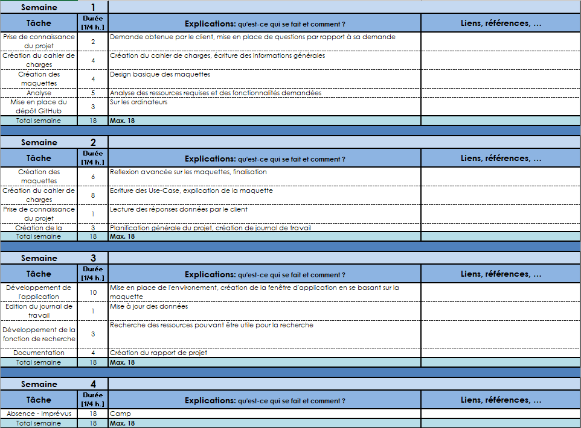
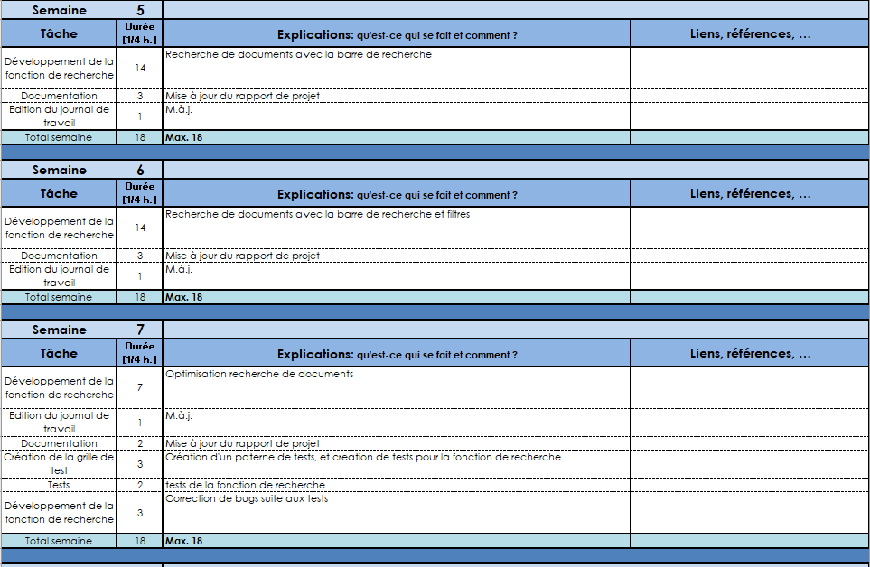
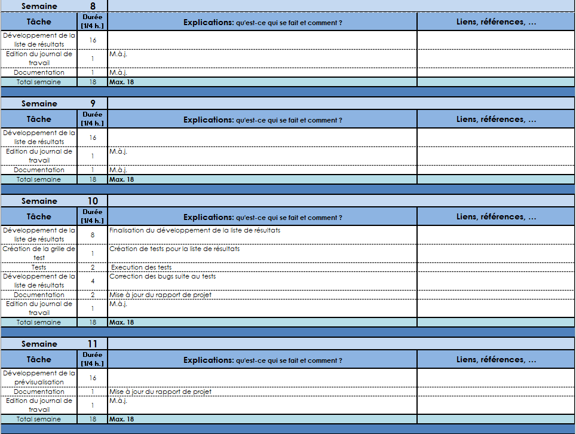
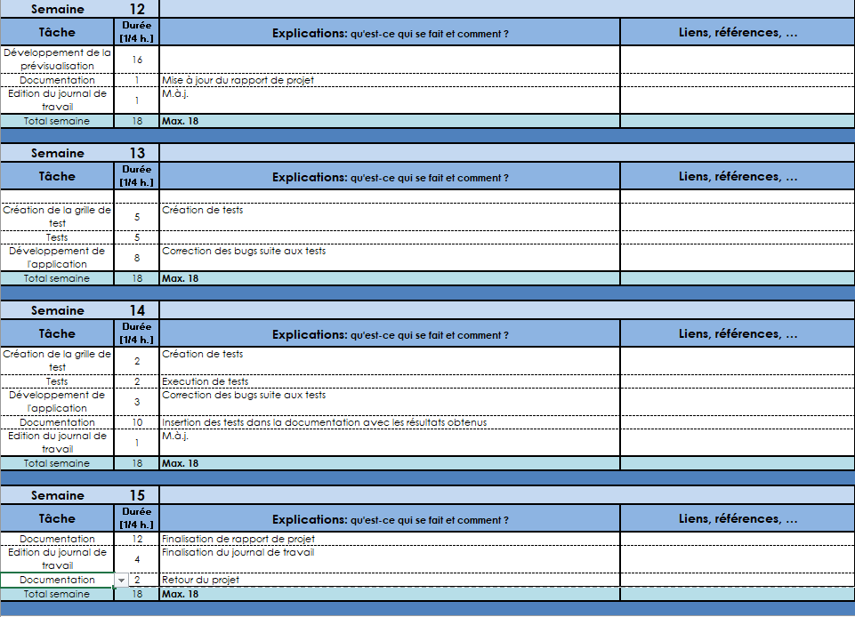

## Analyse
### Oportunités
La création de cette application va nous permettre de :
*	Nous améliorer en C#, découvrir de nouvelles fonctions, libraires, etc.
*	Progresser en écriture de rapport de projet. 
*	Apprendre à utiliser le potentiel de chaque développeur en séparant le travail par tâches.
*	Développer une fonction de recherche à l’intérieur des documents.
*	Trouver un moyen de rendre la recherche la plus rapide possible.
*	Le travail en groupe peut apporter des conflits, savoir les gérer.

### Document d’analyse et conception
Le but est de créer une application qui permet d’effectuer des recherches avancées de documents sur un système Windows quelconque. Nous sommes mandatés par un client qui rencontre des difficultés à faire de recherches du a un grand nombre de documents.

> La fonctionnalité de recherche sera accompagnée de filtres qui permettront par exemple de visualiser uniquement les images, les vidéos ou les documents !

#### Maquettes
En ce qui concerne le visuel de l’application, nous avons créé des maquettes correspondant à chaque étape de la recherche : 

1. Démarrage de l’application.
    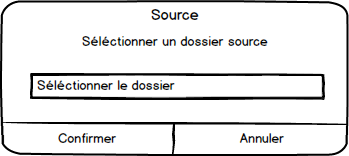

2. Sélection du dossier d’où les recherches seront effectuées. Une fois le répertoire sélectionné, l’application se lance.
    
    Ce bouton permet de choisir un autre répertoire source

3. Ici, on recherche « documents.docx ». Etant donné qu’il n’existe pas, aucun résultat n’apparait.
    

    document.docx est recherché mais aucun résultat n'apparaît

4. On recherche maintenant « mondocument » et plusieurs résultats apparaissent. 
    

5. On applique le filtre documents et on clique sur le document qui nous intéresse. On peut voir à droite qu’une fenêtre avec un aperçu du contenu du document est apparue.
    
    L’aperçu du contenu du fichier fonctionnera uniquement avec des documents non formatés. Nous allons essayer de faire en sorte qu’il soit possible d’apercevoir le plus de documents possible. En ce qui concerne les images une miniature sera affichée, pour le reste rien n’est prévu à ce jour.

6. Dernière fonctionnalité, lorsque l’on fait un clic droit sur le document qui nous intéresse, un menu propose d’ouvrir avec soit l’application correspondant à l’extension soit l’explorateur Windows avec l’emplacement du fichier.
    
#### Architecture

En ce qui concerne l’architecture de nos méthodes, le schéma
est plutôt simple :
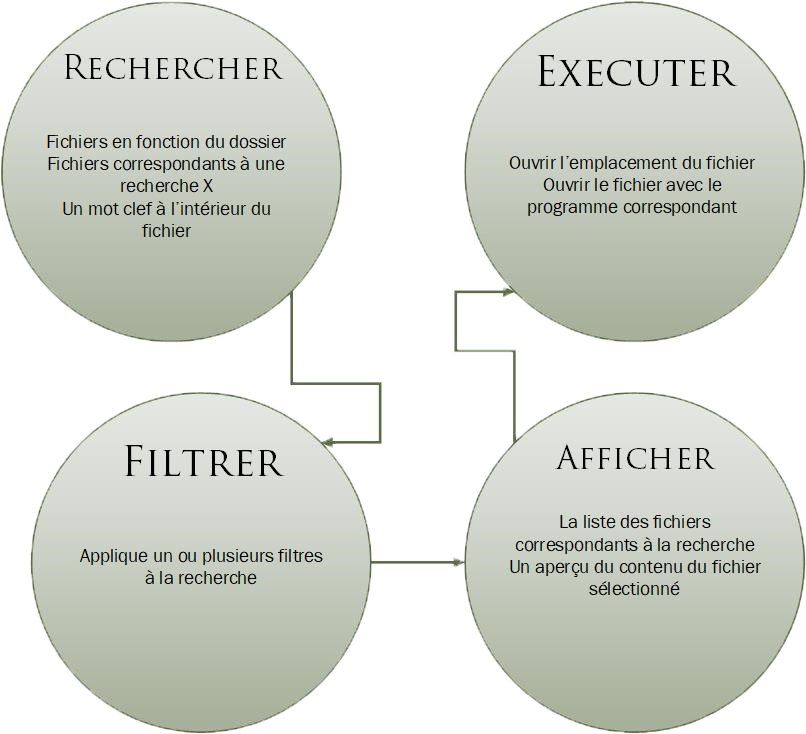

### Conception des tests
Nos tests vont être effectués suivant une grille qui comportera les colonnes suivantes :

| Fonctionnalité à tester               | Résultat attendu                                             | Date    | Résultat obtenu                 | Etat                                |
| ------------------------------------- | ------------------------------------------------------------ | ------- | ------------------------------- | ----------------------------------- |
| Exemple: Clic sur le bouton Parcourir | Une fenêtre s'ouvre et l'utilisateur peut sélectionner un dossier à exploiter | 11 déc. | La fenêtre s'ouvre correctement | OK |

Au fur et à mesure de l'avancement du projet, nous allons ajouter des fonctionnalités à tester dans la grille.

### Répartition des tâches

Il est vital pour un projet de groupe de faire une répartition des tâches, notamment
pour pouvoir utiliser correctement les capacités de chacun.

| Tâches Xavier                          | Tâches Sacha                    |
| -------------------------------------- | ------------------------------- |
| Développement général de l'application | Mise en place et gestion du git |
| Choix de technologies                  | Création des maquettes          |
| Valide les documents                   | Création de la planification    |
|                                        | Création du rapport de projet   |
|                                        | Participation au développement  |

En plein millieu de notre projet nous avons eu un nouvel élément pour nous épauler : **Nicolas Henry**
Etant donné que lorsqu'il est arrivé nous avions déjà bien avancé dans notre projet, il nous a aidés à :

* Ajouts d'éléments dans l'interface XAML
* Création de diagrammes
* Tests du programmes, complétion de la batterie de tests
* Aide au code
* Participation à la rédaction de certaines parties de la documentation

## Dossier de réalisation

### Mise en place de l'environnement

D’abord, nous avons installé Visual Studio 2017 sur nos postes de travail. Ensuite, un dépôt git a été créé. Pour communiquer avec notre dépôt git nous avons installé l’application « git extensions » un logiciel de gestion de versions simple et efficace. Balsamiq Mockup 3 nous a aidés pour créer les maquettes.

### Outils
#### Git

Accès direct au répertoire Git : [Cliquer ici](http://www.github.com/SachaGrenier/MAW1.1)

L’utilisation que nous avons fait de git n’était pas vraiment cohérente. Nous l’utilisons principalement pour pouvoir être plusieurs à coder sur le même fichier sans que cela pose des problèmes d’enregistrements. De ce fait nous avons chacun notre branche sur laquelle nous travaillons, et avec laquelle nous implémentons des fonctionnalités, des
éléments de l’application. Voici un schéma qui représente l’utilisation de nos branches :

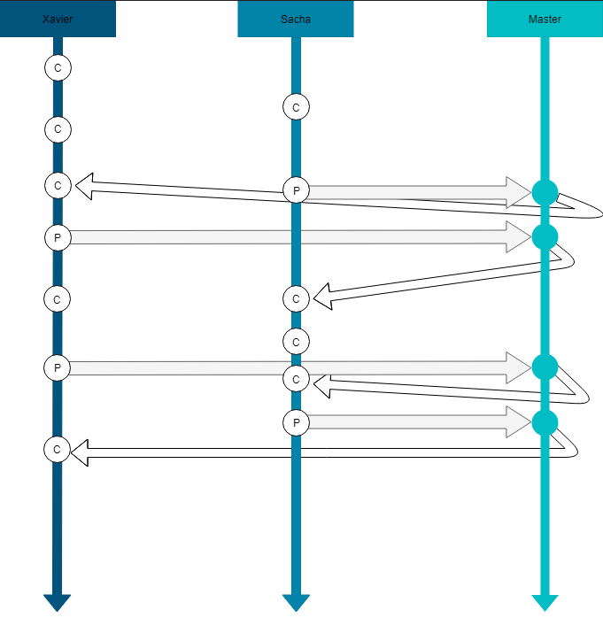

Au total, plus de 100 commits ont été effectués, avec la participation des 3 développeurs :

> [Voir en temps réel](https://github.com/SachaGrenier/MAW1.1/graphs/contributors)

#### Trello

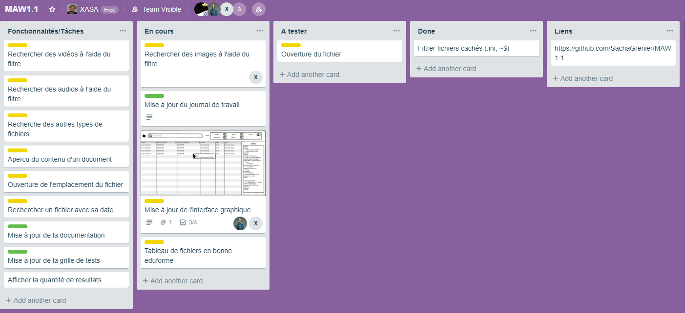

L'application Trello ne nous a pas vraiment été utile durant le projet. A part les quelques fois où nous l'avons utilisée pour savoir ou nous en étions, elle à été pas mal délaissée. [Voir Trello](https://trello.com/b/T5stisYp/maw11)

#### FreeSpire

Pour rechercher à l’intérieur de des documents Word, nous avons utilisé une librairie nommée [Freespire](https://www.e-iceblue.com/Introduce/free-doc-component.html#.XAZ6Q2hKiUk).

Le logiciel comprenant plusieurs versions payantes nous propose une version gratuite, efficace pour Word et qui comporte aussi un module pour PDF, malheureusement pas assez complet et accessible. Nous avons donc choisi d’utiliser une autre librairie nommée :

#### iTextSharp

NuGet installé par nos soins qui nous a ajouté des fonctionnalités permettant de lire des fichiers .PDF. Ces méthodes nous on permis de pouvoir rechercher des mots clés à l'intérieur des documents PDF.

## Fonctionnalités
### Rechercher

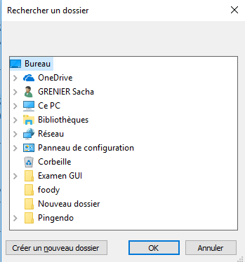

Pour récupérer le chemin à partir duquel l'utilisateur souhaite rechercher ses fichiers, une petite interface apparaît lorsque on lance l'application. 

Une fois le dossier sélectionné, l'application apparaît avec tous les résultats affichés dans la grille. Il est toujours possible de changer de dossier source à partir du bouton en haut à gauche.

Pour rechercher efficacement dans un système de fichiers Windows nous utilisons LinQ; une librairie intégrée à Visual Studio. LinQ est un composant développé par Microsoft, nous avons donc une documentation complète et précise pour nous épauler.

Cette libraire permet de faire des requêtes avec une syntaxe similaire au SQL, langage avec lequel le groupe est à l'aise.

Il faut savoir que la recherche est faite de manière récursive, donc si le fichier se situe dans un sous-dossier le programme se débrouillera pour le trouver.

#### Code

FileDetails ainsi que les autres classes se finissant pas "Details" sont les classes définissant le modèle des différents fichiers.

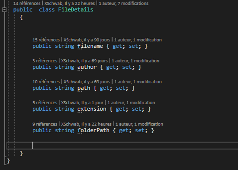

Voici la méthode makeList() que nous utilisons pour remplir les modèles avec les données des fichiers du dossier choisit.

- A Récupère la liste complète de fichiers, vérifie si le filtre Word est sélectionné et vide la liste persistante Word si elle n'est pas vide
- B Vide la liste wordFile, parcours la liste de fichiers et si l'extension du fichier correspond à la liste d'extensions (tapée en dur), crée l'objet id avec les paramètre voulus puis remplit la liste wordFile avec  le résultat obtenu.
- C Vérifie qu'il n'y aie pas de doublons dans la liste de fichiers, compte combien d'éléments sont dans cette dernière(cette information est utilisée dans l'UI pour afficher le nombre de résultats) et remplit la liste persistante Word avec le résultat retourné.

Voici la classe que nous utilisons pour utiliser LinQ :

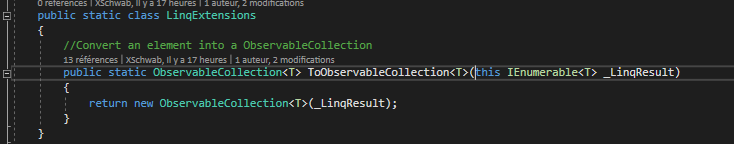

Voici un exemple d'une recherche utilisant LinQ. 

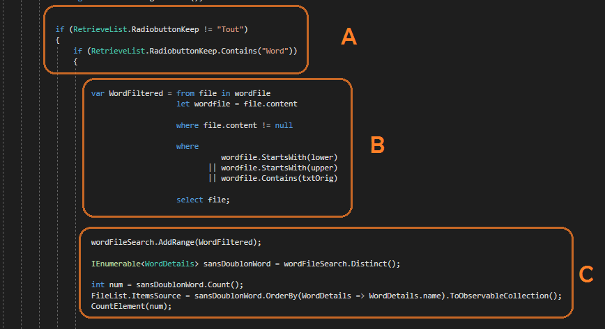Cette requête est utilisée lorsque le filtre "Word" est activé.

* A Vérifie que le filtre Word soit activé
* B Requête LinQ qui permet de rechercher tous les fichiers Word ainsi que leur contenu si l'élément à une correspondance
* C Le fichier, s'il correspond, est ajouté au tableau de fichiers word. On vérifie ensuite qu'il n'y aie pas de doublons, on compte la quantité d'éléments pour l'afficher dans l'application puis on remplit le DataGrid avec les résultats de la recherche

Nous utilisons donc des fonctions offertes par LinQ tel que "where" ou "select" . Nous pouvons alors constater la proximité de la syntaxe avec le langage SQL.

### Filtrer

Les filtres sont affichés sous forme de boutons radio. Lorsque l'on clique sur une option, la liste de résultats se met à jour avec les nouvelles données.

Si quelque chose à déjà été tapé dans la barre de recherche et que vous choisissez un filtre, la liste de résultats se mettera à jour avec le filtre et la recherche.

Les filtres ont été faits à l'aide des extensions de fichiers que nous avons répertorié dans des listes.

Les filtres "Word" & "PDF" sont un peu différents des autres; lorsqu'ils sont sélectionnés, la recherche s'effectuera sur l'ensemble des documents Word et PDF ainsi que leur contenu

Le filtre "Autres" est utilisé pour toutes les extensions n'ayant pas de correspondance dans les autres filtres.

Classes implémentées dans notre projet :

> Les classes de modèles de données correspondant à chaque filtre

* AudioDetails
* FileDetails
* ImageDetails
* OtherDetails
* PDFDetails
* VideoDetails
* WordDetails
* RetrieveList (Stocke la liste de fichiers du répertoire source selon les filtres)

> Les classes ajoutant des fonctionnalités 

* LinqExtensions (Permet d'utiliser LinQ)
* UriToBitmapConverter (Permet de redimensionner les images aperçu )

### Afficher

La liste de résultats se met à jour après n'importe quel nouvelle lettre tapée, ou lorsque le filtre est changé. Pour l'implémentation des données dans le tableau nous avons utilisé un DataGrid. La quantité de résultats est affichée en bas à droite.

> 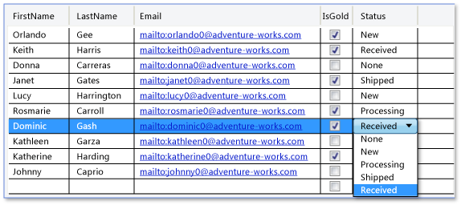

Ceci est un exemple de DataGrid et les possibilités qu'il propose. Très pratique à utiliser car le type de source de données demandé est exactement celui que nous utilisons pour retourner les résultats de la recherche.

Voici à quoi ressemble notre liste de résultats

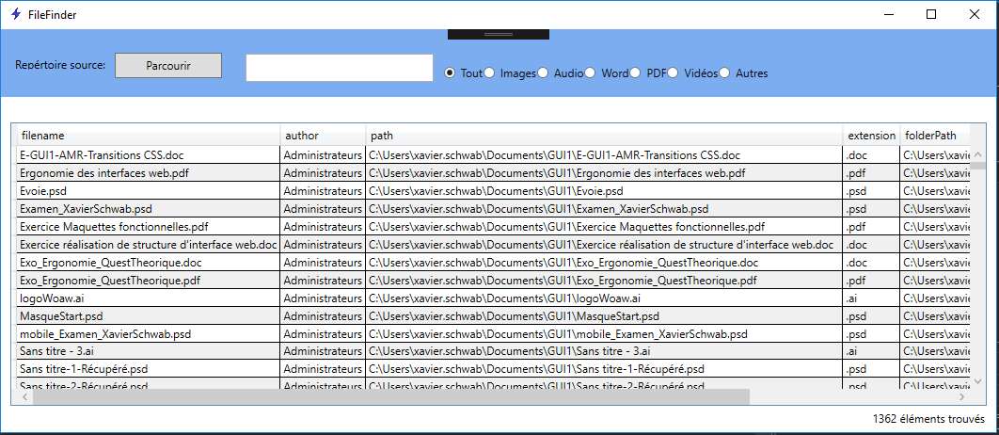

### Exécuter

Nous offrons la possibilité soit d'ouvrir le dossier source du fichier sélectionné, soit d'ouvrir le fichier avec le programme par défaut  

Le clic droit permet d'ourvir le dossier source :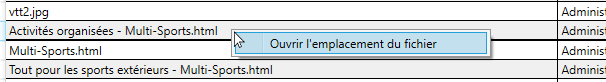

Le double clic gauche permet ouverture du fichier avec le programme par défaut.

### Bugs/Problèmes connus

* Interface graphique (XAML) très moyenne, nous n'avons pas réussi à faire quelque chose de mieux.
* Utilisation du DataGrid, les entêtes que nous n'avons pas réussi à modifier nous on posé des soucis.
* Rapidité de recherche, efficace en général mais peut avoir des ralentissements.
* Le dépôt git nous à posé des petits soucis avec les conflits de merge. 

### Améliorations

Nous avons des idées pour améliorer notre application, en voici en liste non-exhaustive :

* Colorer élément en bleu lorsque un clic droit est effectué
* Améliorer la fluidité de la recherche
* Meilleure utilisation des header du tableau
* Faire un focus sur l'application une fois le dossier source sélectionné
* Une méthode générique pour les filtres pour que nous puissions en rajouter facilement
* Utilisation d'une banque de données pour les extensions 

### Installation

Téléchargez le dossier FilesFinder sur github (ou clonez tout le dépôt si vous le souhaitez) [Download](https://github.com/SachaGrenier/MAW1.1/tree/master/FilesFinder)

Lancez ensuite FilesFinder.exe dans le dossier Application. Il est possible que le raccourci ne fonctionne pas, vous pouvez toujours en créer un facilement.

## Tests

### Batterie de tests

| Fonctionnalité   à tester                                    | Résultat attendu                                             | Date    | Résultat obtenu                                              | Etat                                 |
| ------------------------------------------------------------ | ------------------------------------------------------------ | ------- | ------------------------------------------------------------ | ------------------------------------ |
| Clic sur le bouton "Parcourir"                               | Une fenêtre s'ouvre et l'utilisateur peut sélectionner un dossier à exploiter | 11 déc. | La fenêtre s'ouvre correctement, l'arborescence s'affiche    | OK |
| Lancer l'application                                         | Une recherche de dossier s'ouvre                             | 13 dec. | La fenêtre s'ouvre                                           | OK |
| Sélection du dossier                                         | Affichage du dossier                                         | 13 déc. | Le contenu du dossier s'affiche                              | OK |
| Recherche du fichier   "index"                               | Les fichiers dont le nom contient "index" s'affichent        | 13 déc. | Les fichiers s'affichent                                     | OK |
| Ouverture du fichier                                         | Le fichier s'ouvre avec le programme par défaut              | 13 déc. | Le fichier s'ouvre ou propose un programme                   | OK |
| Clique droit sur l'élément de la liste+ Ouvrir l'emplacement du fichier | Le dossier s'ouvre                                           | 13 déc. | Le dossier s'ouvre                                           | OK |
| Filtre des fichier                                           | Les fichiers du type s'affichent                             | 13 déc. | Les fichiers s'affichent en fonction de leurs type           | OK |
| Ouvrir le fichier                                            | Le fichier s'ouvre avec le programme par défaut              | 13 déc. | Le fichier s'ouvre avec le programme par défaut              | OK |
| Clique droit + afficher le   dossier                         | Le dossier s'ouvre                                           | 13 déc. | Le dossier s'ouvre                                           | OK |
| Sélectionner un nouveau   dossier                            | Affichage du dossier                                         | 13 déc. | Le dossier s'affiche                                         | OK |
| Recherche du fichier   "index"                               | Les fichiers "index" s'affichent                             | 13 déc. | Les fichiers s'affichent                                     | OK |
| Ouverture du fichier                                         | Le fichier s'ouvre avec le programme par défaut              | 13 déc. | Le fichier s'ouvre ou propose un programme                   | OK |
| Clique droit + afficher le   dossier                         | Le dossier s'ouvre                                           | 13 déc. | Le dossier s'ouvre                                           | OK |
| Filtre des fichier                                           | Les fichiers du type s'affichent                             | 13 déc. | Les fichiers s'affichent après une nouvelle recherche        | OK |
| Ouvrir le fichier                                            | Le fichier s'ouvre avec le programme par défaut              | 13 déc. | Le fichier s'ouvre                                           | OK |
| Clique droit + afficher le   dossier                         | Le dossier s'ouvre                                           | 13 déc. | Le dossier s'ouvre                                           | OK |
| Lancer l'application sans   choisir de dossier source        | L'application se lance sans dossier                          | 13 déc. | L'application se lance                                       | OK |
| Rechercher un document avec sa date de modification          | Les fichiers correspondants à la date recherchée restent dans la liste | 14 déc. | Les fichiers  correspondants restent dans la liste, sans filtre | OK |
| Rechercher un document avec sa date de création              | Les fichiers correspondants à la date recherchée restent dans la liste | 14 déc. | Les fichiers  correspondants restent dans la liste,sans filtre | OK |
| Rechercher des fichiers avec le nom de l'auteur              | Les fichiers correspondants à l'auteur recherchée restent dans la liste | 14 déc. | Résultat satisfaisant                                        | OK |

### Consommation

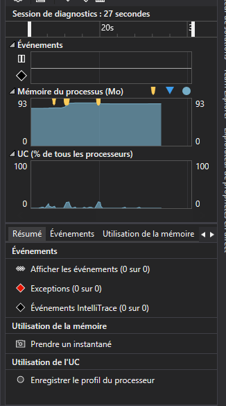

> Nous pouvons remarquer que la consommation de RAM ainsi que la charge CPU sont linéaires et modestes

## Conclusion

### Bilan Maquette/Produit final
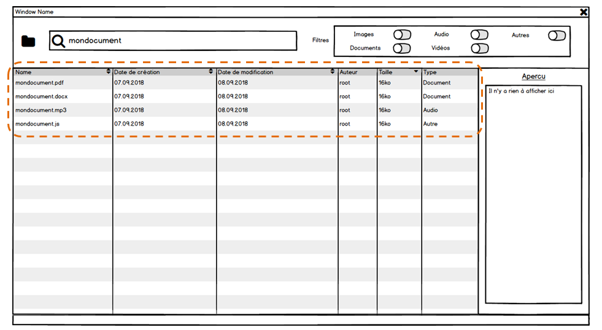
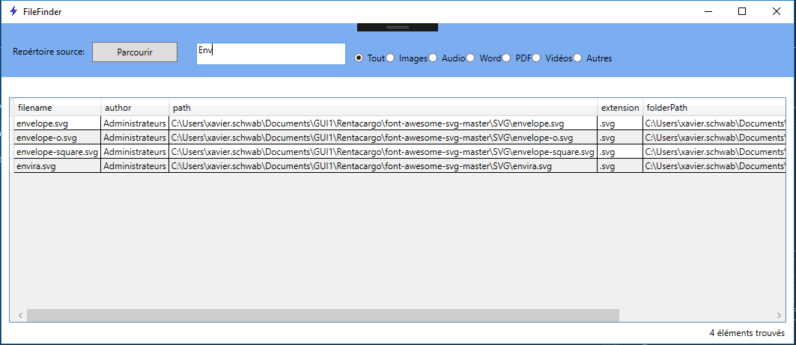

De manière générale, nous avons plutôt bien respecté notre maquette. On peut remarquer une différence nette principale sur le liste de résultats ainsi que la prévisualisation des fichiers. Cette différence est due au fait que nous ne maîtrisons pas bien le XAML, nous avons donc fait au plus simple. Nous trouvons tout de même que le résultat final se défend bien, l'espace est bien utilisé.

On peut remarquer aussi que les collones de la liste de résultat finale ne correspondent pas à la maquette, qui est clairement plus adaptée, plus complète. 

### Bilan des fonctionnalités demandées

Dans l’ensemble le projet est tout de même bien avancé. Il est vrai que des améliorations sont possibles. Nous avons pris beaucoup de temps pour développer les fonctions de recherche, principalement avec les filtres Word & PDF qui nécessitaient des librairies spécifiques. Nous avons perdu un peu de temps avec la première librairie (FreeSpire) que nous voulions utiliser pour générer les PDF, que nous n'avons pas utilisée car elle était payante pour ses fonctionnalité PDF avancé. 

### Bilan de la planification

Nous pensons avoir correctement suivi le planning. On a notamment perdu du temps sur l’analyse et sur le développement du de la recherche qui est la fonction qui nous a pris le plus de temps. 

De plus, nous avons rencontré des problèmes avec git, dus à de mauvaises manipulation et des conflits de merge.

## Sources

Journal de travail : [cliquez ici](https://github.com/SachaGrenier/MAW1.1/blob/master/Docs/Planification/MAW-grenier-schwab-Plannif-JDT.xlsm)

Batterie de tests : [cliquez ici](https://github.com/SachaGrenier/MAW1.1/blob/master/Docs/Tests/Batterie_de_tests.xlsx)